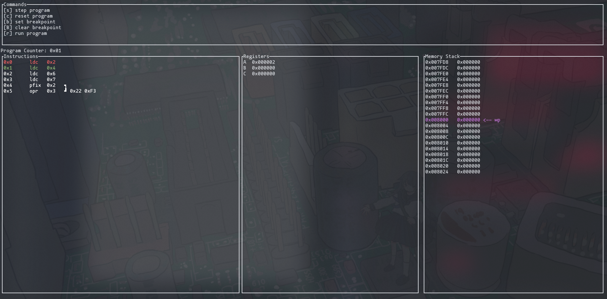

# T800 Emulator

This is an in-progress rust implementation of a T800 transputer. I am currently implementing instructions with correspodning verification tests. I also am putting together a debugger.

The T800 is based on RISC and embedded systems, and was made in the 90s by INMOS. The instruction set consists of 15 direct instructions, and several indirect instructions. Multi process behavior is built into the chip, with microcode managing process switching. Certain instructions such as `JUMP` act as descheduling points where another process can begin.

Debugger using `tui-rs`:



I've implemented all the direct instructions and am now going through the indirect ones, then will add the process manager.


# Hello world

I put a terminal register on `0x0001_0000`, this can be used to write a hello world program :).

```
; Hello world
ldc 72 ; H
ldc 65536 ; TERMINAL OUTPUT REGISTER
stnl 0
ldc 69 ; E
rev
stnl 0
ldc 76 ; L
rev
stnl 0
stnl 0
ldc 79 ; O
rev
stnl 0
ldc 10 ; \n
rev
stnl 0
```

This prints out "HELLO" to the terminal.